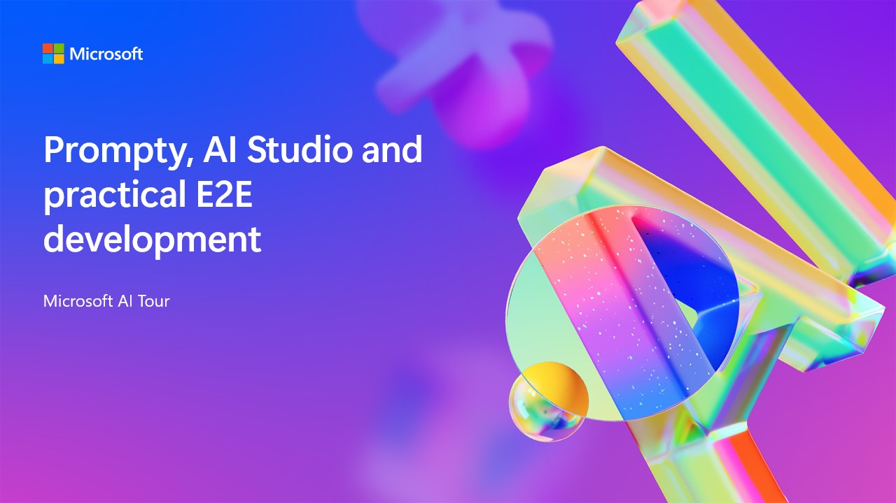

<!-- To help prepare content for AI Tour, please use this template repository for organizing your sessions and preparing the content for future presentors.
1. Update this readme with the todo's listed below
2. The src folder has been created for all development tasks when creating this session
3. The Lab folder is in-person and async participation with content, please update this folder with instructions for participants to follow along.
4. The Presenter Notes folder is the train the trainer section. Here add any slide decks, demo videos, and other content as needed. This page has a rough layout to provide ideas but can be edited as needed.
5. If you are taking advantage of the static front end site, edit the content in the _config.yml file as needed (specifically the title and description) -->

# AI Tour BRK450 - Prompty, Azure AI Foundry and practical E2E development.

This repo is intended for resources of the breakout session: Prompty, Azure AI Foundry and practical E2E development.

## Session Desciption

Integrating GenAI into traditional development can be daunting. Prompty simplifies LLM app development and works seamlessly with tools like Visual Studio Code and GitHub. Learn how to build multi-model LLM (agent)  architecture, evaluation, deployment, and monitoring.

### Duration
45 Minutes

### [Slide Deck](https://aka.ms/AAs1k7u)

## Learning Outcomes
By the end of this session you will understand:
* How to get started with LLMs​
* Understand the Prompty Specification​
* How to get started with Prompty in Visual Studio Code​
* ​How to develop an App with Prompty​

## Technology Used
* [Azure AI Foundry](https://learn.microsoft.com/en-us/azure/ai-foundry/](https://learn.microsoft.com/en-us/azure/ai-foundry/)
* [Prompty](https://www.prompty.ai/)
* [PromptFlow](https://microsoft.github.io/promptflow/index.html)
* [Visual Studio Code](https://code.visualstudio.com/)

## Additional Resources and Continued Learning
<!-- TODO: If you would like to link the user to further learning, please enter that here. -->

| Resources          | Links                             | Description        |
|:-------------------|:----------------------------------|:-------------------|
| Prompty Documentation  | [Prompty](https://www.prompty.ai/) | Learn more about Prompty |
| Azure AI Samples  | [Azure AI Samples](https://aka.ms/azd-ai-templates/) | Learn more about how you can build Prompty projects |

## Content Owners
<!-- TODO: Add yourself as a content owner
1. Change the src in the image tag to {your github url}.png
2. Change INSERT NAME HERE to your name
3. Change the github url in the final href to your url. -->

<!-- ALL-CONTRIBUTORS-LIST:START - Do not remove or modify this section -->

<table>
<tr>
    <td align="center"><a href="http://learnanalytics.microsoft.com">
         
        <b>Seth Juarez</b></a> 
            <a href="https://github.com/sethjuarez" title="talk">📢</a> 
    </td>
    <td align="center"><a href="http://learnanalytics.microsoft.com">
         
        <b>Bethany Jepchumba </b></a> 
            <a href="https://github.com/bethanyjep" title="talk">📢</a> 
    </td>
</tr></table>
<!-- ALL-CONTRIBUTORS-LIST:END -->

## Responsible AI 

Microsoft is committed to helping our customers use our AI products responsibly, sharing our learnings, and building trust-based partnerships through tools like Transparency Notes and Impact Assessments. Many of these resources can be found at [https://aka.ms/RAI](https://aka.ms/RAI).
Microsoft’s approach to responsible AI is grounded in our AI principles of fairness, reliability and safety, privacy and security, inclusiveness, transparency, and accountability.

Large-scale natural language, image, and speech models - like the ones used in this sample - can potentially behave in ways that are unfair, unreliable, or offensive, in turn causing harms. Please consult the [Azure OpenAI service Transparency note](https://learn.microsoft.com/legal/cognitive-services/openai/transparency-note?tabs=text) to be informed about risks and limitations.

The recommended approach to mitigating these risks is to include a safety system in your architecture that can detect and prevent harmful behavior. [Azure AI Content Safety](https://learn.microsoft.com/azure/ai-services/content-safety/overview) provides an independent layer of protection, able to detect harmful user-generated and AI-generated content in applications and services. Azure AI Content Safety includes text and image APIs that allow you to detect material that is harmful. Within Azure AI Foundry, the Content Safety service allows you to view, explore and try out sample code for detecting harmful content across different modalities. The following [quickstart documentation](https://learn.microsoft.com/azure/ai-services/content-safety/quickstart-text?tabs=visual-foundry%2Clinux&pivots=programming-language-rest) guides you through making requests to the service.

Another aspect to take into account is the overall application performance. With multi-modal and multi-models applications, we consider performance to mean that the system performs as you and your users expect, including not generating harmful outputs. It's important to assess the performance of your overall application using [Performance and Quality and Risk and Safety evaluators](https://learn.microsoft.com/azure/ai-foundry/concepts/evaluation-metrics-built-in). You also have the ability to create and evaluate with [custom evaluators](https://learn.microsoft.com/azure/ai-foundry/how-to/develop/evaluate-sdk#custom-evaluators).

You can evaluate your AI application in your development environment using the [Azure AI Evaluation SDK](https://microsoft.github.io/promptflow/index.html). Given either a test dataset or a target, your generative AI application generations are quantitatively measured with built-in evaluators or custom evaluators of your choice. To get started with the azure ai evaluation sdk to evaluate your system, you can follow the [quickstart guide](https://learn.microsoft.com/azure/ai-foundry/how-to/develop/flow-evaluate-sdk). Once you execute an evaluation run, you can [visualize the results in Azure AI Foundry](https://learn.microsoft.com/azure/ai-foundry/how-to/evaluate-flow-results).
