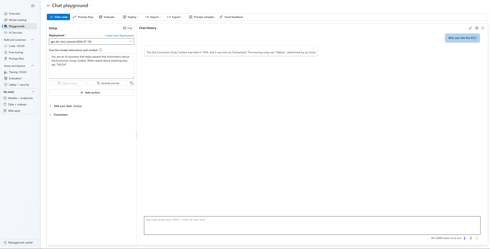

# Demo 1: Azure AI Foundry portal

Large Language Models, LLMs, are similiar to language calculators. In this section, we cover how you can interact with LLMs on Azure AI Foundry portal

## Chat Playground

First, you will need to create a project on [Azure AI Foundry portal](https://ai.azure.com) and deploy a model of your choice, in this demo use GPT-4. 

> [NOTE!]
> You can follow instructions in the [setup](setup.md) to create your Azure AI Foundry portal environment.




Once in the chat playground, go ahead and change the system message to have the model purpose be to help people find information on the Eurovision Song Contest (ESC), as follows:

```
You are an AI assistant that helps people find information about the Eurovision Song Contest. When asked about anything else, say "SALSA!"
```

Once the system message is successfully updated, ask the model a question on ESC:

```
Who won the first ESC?
```

The model will give a reply with details on who won the contest. In additon, ask the model on a more recent Eurovision Song Contest:

```
Who won ESC in 2023?
```

The model's training cut-off date was before the Eurovision Song Contest in 2023, therefore, it will return a reply that it cannot be able to give details on the contest due to not having the data. This is where Retrieval Augumented Generation comes in.

## Retrieval Augmented Generation

Retrieval Augumented Generation (RAG) is where you add in additional data to be able to enhance the model. To the system instruction, add in the following data from Wikipedia, on ESC 2023, to update the system message with on new information:

```
The Eurovision Song Contest 2023 was the 67th edition of the Eurovision Song Contest. It took place in Liverpool, United Kingdom, as Ukraine, the winner of the 2022 contest with the song "Stefania" by Kalush Orchestra, was unable to host the event due to the Russian invasion of the country. It was organised by the European Broadcasting Union (EBU), with the British Broadcasting Corporation (BBC) acting as host broadcaster on behalf of the Public Broadcasting Company of Ukraine (UA:PBC). The contest was held at Liverpool Arena, and consisted of two semi-finals on 9 and 11 May and a final on 13 May 2023. The three live shows were presented by British singer Alesha Dixon, British actress Hannah Waddingham, and Ukrainian singer Julia Sanina, with Irish television presenter Graham Norton joining for the final.

The winner was Sweden with the song "Tattoo", performed by Loreen and written by her with Jimmy Thörnfeldt, Jimmy Jansson, Moa Carlebecker, Peter Boström, and Thomas G:son. Finland, Israel, Italy, and Norway completed the top five. Sweden won the combined vote and jury vote, and came second to Finland in the televote. Loreen became the second performer to win the contest twice, after Irish singer Johnny Logan; it was also the seventh win for Sweden, tying Ireland's record for the most Eurovision victories.
```

Repeat the question again to the model on ESC 2023.

```
“Who won the Eurovision Song Contest in 2023?”
```

## Handling other questions

Ask additional questions to the LLM:

```
Question 1: What should I put on my tacos?
Question 2: What is the best style of dance?
```

The reply will allways be ``SALSA!`` based on the system message instructions where it is specified: ```When asked about anything else, sasy "SALSA!"```

## Conclusion

In building Generative AI applications, prompts are essential as they guide the AI on how to respond. Through using prompts, you can be able to modify your LLM and curate the responses you receive. How can you put prompts first when building Generative AI applications?

The next demo will cover more about Prompty and how you can get started with building and customizing your LLM applications.