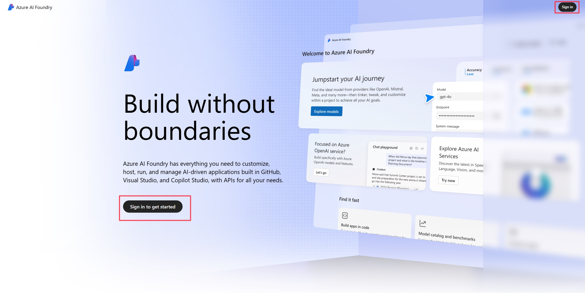
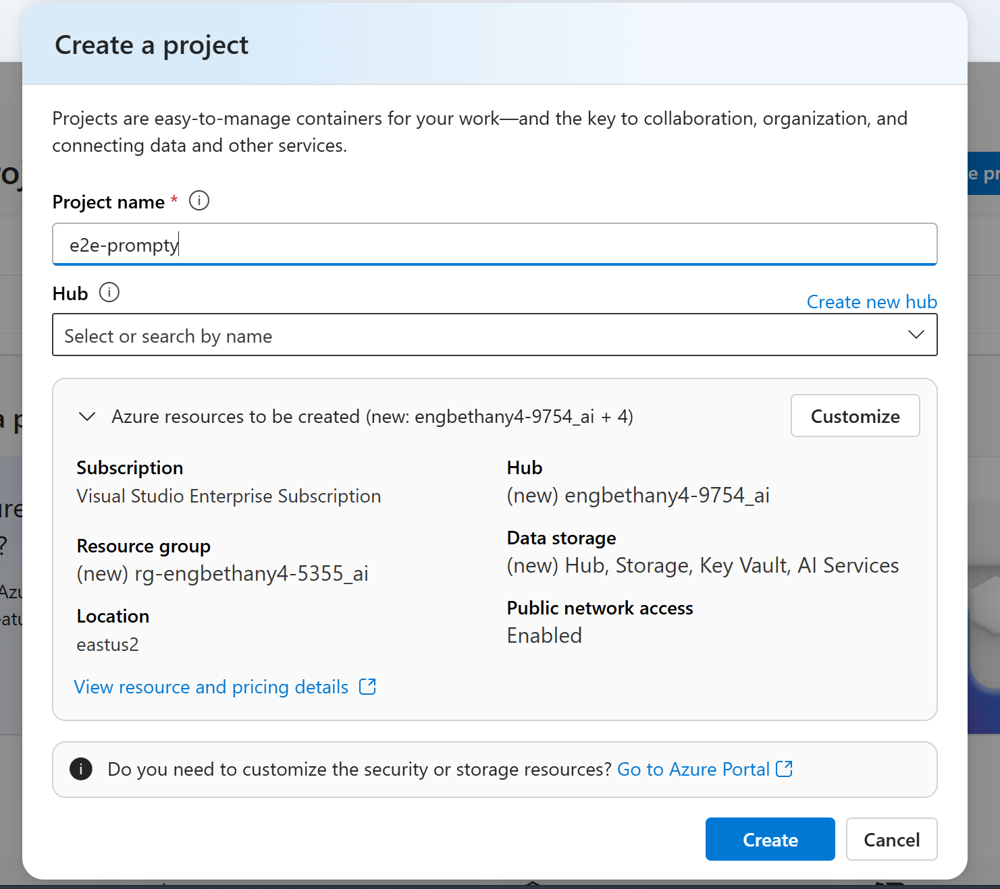
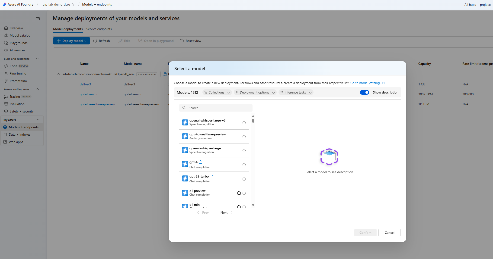
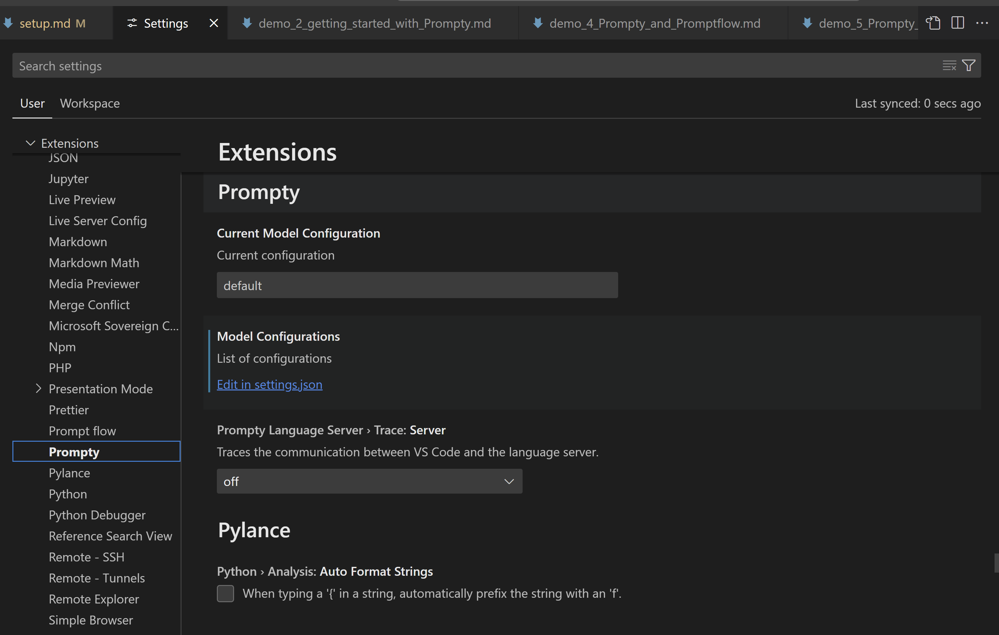
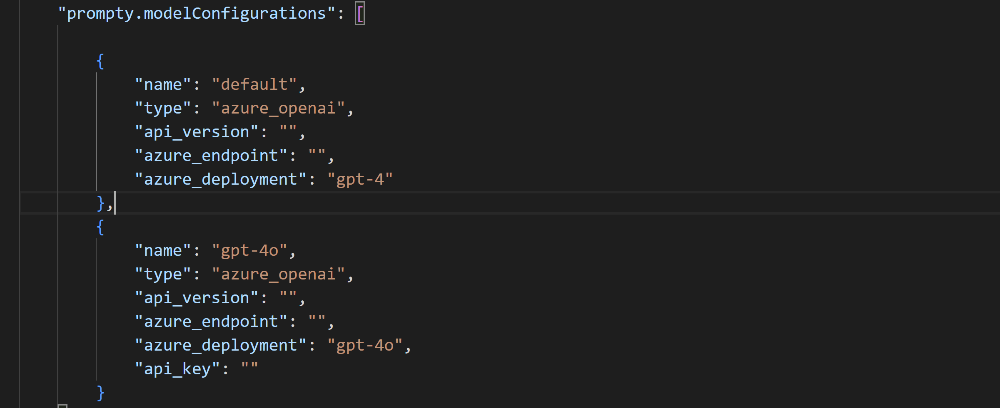

# TO-DO - setup

## Setting up Azure AI Foundry portal

Follow the steps below to setup your Azure AI Foundry portal environment:

1. Navigate to [Azure AI Foundry portal](https://ai.azure.com?WT.mc_id=aiml-149230-bethanycheum) and login with your Azure account.

2. Create a new project, you will also be prompted to create a new hub that will host your project.

3. Once you have successfully created your project, navigate to the deployments tab and deploy your Azure Open AI models i.e. ``GPT-4o`` and ``GPT-4``

You are now ready to start the first demo on the introduction to Azure AI Foundry portal and LLMs.

## Setting up your local Visual Studio Code

1. Install the [Prompty Extension](https://marketplace.visualstudio.com/items?itemName=ms-toolsai.prompty)

1. Log in to your Azure account using ``az login`` on the terminal. (You can also use ``az login --use-device-code``.)

3. Edit ``settings.json`` file to update your LLM details. You can edit this by navigating to ``settings > Extensions > Prompty > Edit in settings.json``

4. Update your credentials and settings.

> [TIP!]
> In case you encounter any challenges with permissions, you can follow the instructions for [Role-based access control for Azure OpenAI Service](https://learn.microsoft.com/en-us/azure/ai-services/openai/how-to/role-based-access-control?WT.mc_id=aiml-149230-bethanycheum) to give access to your resources.
