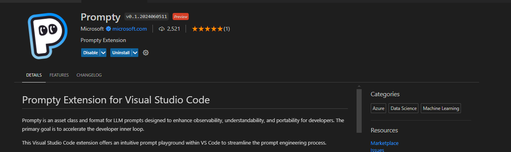
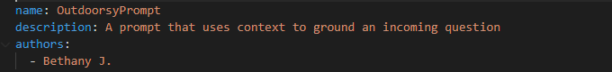
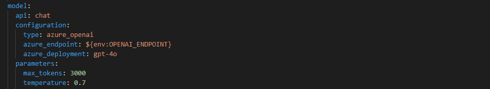
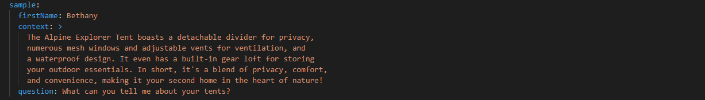
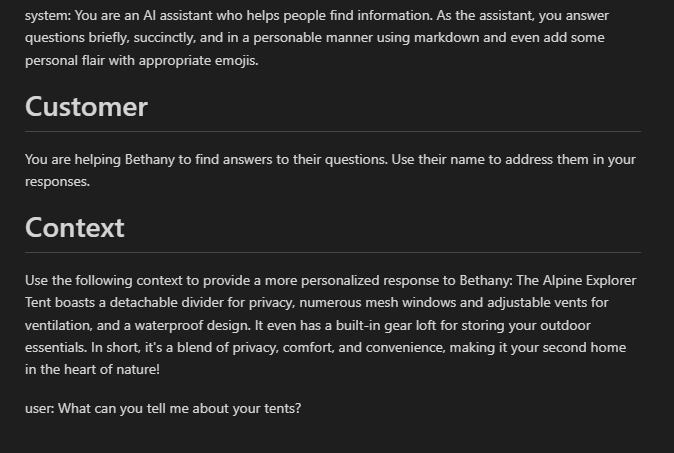

# Getting Started with Prompty

I can liken Prompty to the AI Studio playground. Prompty is an asset class format for LLMs that provides observability, understandability and portability for developers. It puts prompts at the centre of your development accelerating prompt engineering and prompt source management.

To get started with Prompty, first, install the Prompty extension in the Visual Studio Code Marketplace.

## Step 1: Install the Prompty extension
1. Open ``Visual Studio Code (VSCode)``.
1. Go to the ``Extensions`` view by clicking on the Extensions icon in the ``Activity Bar`` on the side of the window.
1. Search for ``“Prompty”`` and install the extension.

> [!TIP]
> You can download the [VS Code extension here.](https://marketplace.visualstudio.com/items?itemName=ms-toolsai.prompty)

## Step 2: Create a new Prompty file
1. Once the extension is installed, go to your files in VS Code.
1. Right-click and select “New File”. A new file with a ``.prompty`` extension will be created.

## Step 3: Edit the Prompty file

The Prompty file consists of two main parts: Metadata in yaml and System Message in Markdown with templating.

### Update Metadata

the description attributes:

1. **Name:** Change the name of your prompt file to ``OutdoorsyPrompt``
1. **Description:** Keep the description as it is.
1. **Author:** Update the author name to your name.

the model attributes:

1. **api:** chat API to be used for our application
1. **Model Configuration:**
    1. **type:** ``azure_openai`` model type as we will be using Azure OpenAI Service models
    1. **azure_endpoint:** add in your Azure endpoint for example: . In the next section, these will be updated with our environment variables.
    1. **azure_deployment:** Specify the deployment, e.g., GPT-4.0.
1. **Model Parameters:** here you can specify some parameters for your model, for instance:
    1. **max_tokens:** Set maximum tokens to 3000.
    1. **temperature:** Add temperature and set it to 0.7.

the sample inputs:

1. **Sample inputs:** here define the model inputs
    1. **First Name:** Update it to your name.
    1. **Context:** This provides additional information for the model.
    1. **Question:** the question a user asks, similiar to the user prompt in Azure AI Studio

## System Instructions and user prompt

Use the existing system instructions. You can preview the Prompty file to check if the sample data is updated in the instructions

## Step 4: Run the Prompty File
Run the file to get a response based on the question. The response should include personalized details, such as your name.