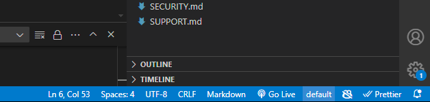

# Configuring your Azure OpenAI Service API

Prompty allows you to configure your API either using environmental variables or through ``settings.json``

## Option 1: Edit Deployment Settings
1. Access Deployment: Click on the ```default`` text on the bottom right side of the screen.



1. Navigate to settings and switch to JSON view.
1. Input the necessary credentials, including endpoint, deployment details, and API key.

## Option 2: Use Environment File (.env)
1. Create a new .env file in your project directory.
1. Add Parameters: Include the following parameters in the .env file:

```
OPENAI_API_VERSION = 
OPENAI_CHAT_DEPLOYMENT_NAME = 
OPENAI_ENDPOINT = 
OPENAI_API_KEY =
```
1. Update your Prompty model configuration to use environment variables. Use the following syntax to reference environment variables: ``${env:ENVIRONMENT_VARIABLE_NAME}``

## Step 4: Run Configuration
1. Run your Prompty file to see if it is successful.
1. Ensure that the output is as expected.