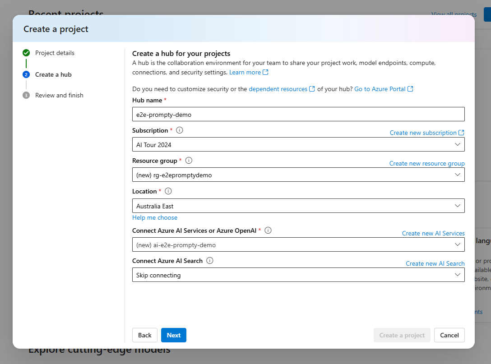

# TO-DO - setup

## Setting up Azure AI Studio

Follow the steps below to setup your Azure AI Studio environment:

1. Navigate to [Azure AI Studio](https://ai.azure.com) and login with your Azure account, once logged in, create a new project.

1. Create a new project, you will also be prompted to create a new hub that will host your project.

1. Once you have successfully created your project, navigate to the deployments tab and deploy your Azure Open AI models i.e. ``GPT-4o`` and ``GPT-4``

You are now ready to start the first demo on the introduction to Azure AI Studio and LLMs.

## Setting up your local Visual Studio Code

1. Log in to your Azure account using ``az login`` on the terminal.

1. Install the [Prompty Extension](https://marketplace.visualstudio.com/items?itemName=ms-toolsai.prompty)

1. Edit ``settings.json`` file to update your LLM details. You can edit this by navigating to xxx